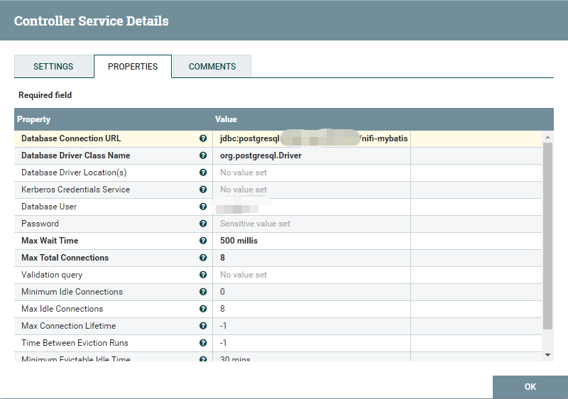

# nifi-mybatis

nifi-mybatis是一个轻量级的数据库访问工具，帮助开发人员在NiFi框架下通过MyBatis访问数据库，并以Controller Service的形式暴露给Processor。

## Features
 * 通过继承的方式实现数据库访问Controller Service;
 * 支持类Spring的依赖注入;
 * 支持NiFi内置的DBCPService/DBCPConnectionPool;
 * 提供线程安全的数据库访问对象；

## Developing
* 事务管理；

## Maven
```xml
<dependency>
    <groupId>org.indunet</groupId>
    <artifactId>nifi-mybatis</artifactId>
    <version>1.0.7</version>
</dependency>
```

## Quick Start
##### Step 1. 定义Controller Service接口，如果你已熟练掌握自定义Controller Service的方法，请直接阅读第2步；
```java
public interface VehicleService extends ControllerService {
    List<VehicleModelDO> listVehicleModel();
    List<VehicleDO> listVehicle();
}
```
##### Step 2. 集成AbstractNiBatisService类并实现上述接口，重写initialize方法，指定MyBatis Mapper的路径，建议MyBatis接口类和XML采用相同命名，并放置在相同目录下。最后调用this.autowire(this)实现依赖注入；
```java
public class VehicleControllerService extends AbstractNiBatisService implements VehicleService {
    @Autowired
    VehicleMapper vehicleMapper;
    @Autowired
    VehicleModelMapper vehicleModelMapper;

    @Override
    protected void initialize(Configuration conf) {
        conf.addMappers("org.indunet.nifi.mapper");

        this.autowire(this);
    }

    @Override
    public List<VehicleDO> listVehicle() {
        return this.vehicleMapper.listVehicle();
    }

    @Override
    public List<VehicleModelDO> listVehicleModel() {
        return this.vehicleModelMapper.listVehicleModel();
    }
}
```
##### Step 3. 打成Nar包，拷贝到$NIFI_HOME/lib目录下，重新启动NiFi;
```shell script
service nifi restart
```
##### Step 4. 由于nifi-mybatis依赖NiFi内置的DBCPConnectionPool，故新建DBCPConnectionPool;

##### Step 5. 配置自定义Controller Service的Database Connection Pooling Service属性；

##### Step 6. 启动Controller Service，任何处理器都可以通过它访问数据库。

## Build Requirements
* Java 1.8+
* Maven 3.5+

### *License*

nifi-mybatis is released under the [Apache 2.0 license](license.txt).

```
Copyright 1999-2020 indunet.org group Holding Ltd.

Licensed under the Apache License, Version 2.0 (the "License");
you may not use this file except in compliance with the License.
You may obtain a copy of the License at the following link.

     http://www.apache.org/licenses/LICENSE-2.0

Unless required by applicable law or agreed to in writing, software
distributed under the License is distributed on an "AS IS" BASIS,
WITHOUT WARRANTIES OR CONDITIONS OF ANY KIND, either express or implied.
See the License for the specific language governing permissions and
limitations under the License.
```
